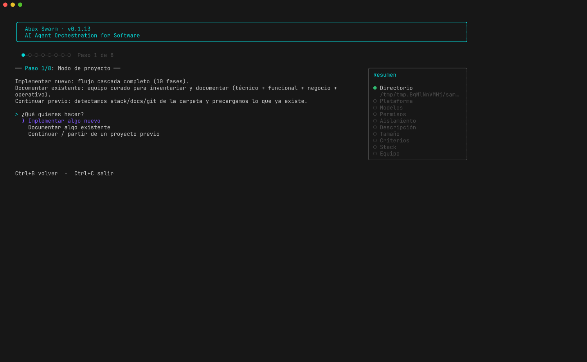
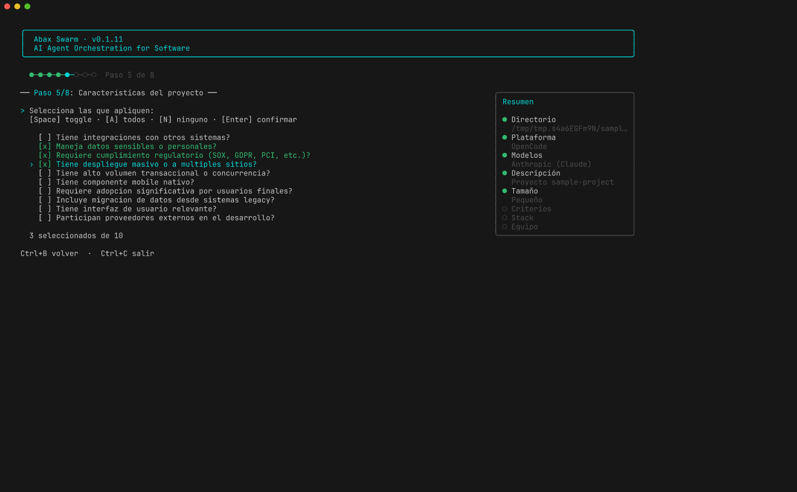
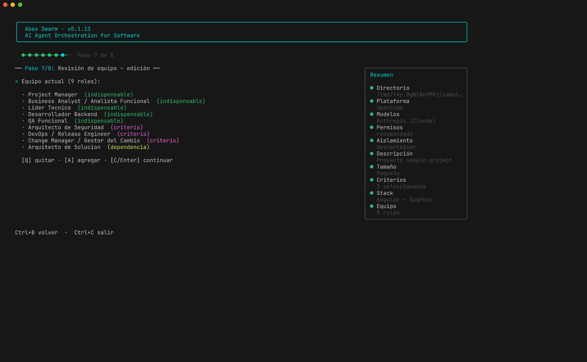
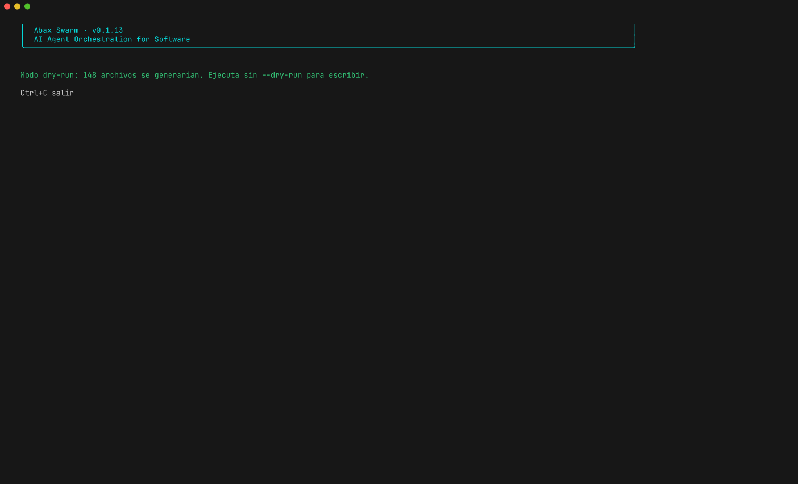

# Abax Swarm

**Genera un equipo de agentes de IA listo para llevar tu proyecto de software de la idea al despliegue.**

Abax Swarm te crea un equipo coordinado de agentes especializados — un Project Manager, un Business Analyst, un Solution Architect, desarrolladores, QA y más — que trabajan juntos siguiendo una metodología en cascada. Tú describes tu proyecto en un asistente interactivo, y la herramienta produce los archivos que tu cliente de IA (OpenCode o Claude Code) necesita para poner a ese equipo a trabajar.

**Tres modos de proyecto**: implementar algo nuevo (cascada completa), documentar un sistema existente (equipo curado + 5 fases + sitio MkDocs), o continuar un proyecto previo (detectores de stack, docs y git para no re-pedirte lo que ya hay).

---

## ¿Esta guía es para mí?

Hay tres caminos en este README según qué quieras hacer. **No tienes que leerlo todo.**

| Si lo que quieres es… | Ve a |
|---|---|
| Usarlo rápido sin saber programación | [Empezar en 2 minutos](#empezar-en-2-minutos) |
| Personalizar el equipo: agregar tu propio rol, otro stack, etc. | [Personalizar tu equipo](#personalizar-tu-equipo) |
| Contribuir al código del propio Abax Swarm | [Para desarrolladores](#para-desarrolladores) |

---

## Empezar en 2 minutos

### 1. Instalar

Necesitas Node.js 20 o superior. Si no lo tienes, instálalo desde [nodejs.org](https://nodejs.org).

```bash
npm install -g abax-swarm
```

### 2. Ejecutar el asistente

```bash
abax-swarm init
```

Aparece un wizard en tu terminal con barra de progreso, resumen lateral y la posibilidad de volver atrás con `Ctrl+B`.




### 3. Responder las preguntas del wizard

No hace falta conocimiento técnico para responder. Cada paso te explica las opciones. El número exacto de preguntas depende del modo de proyecto que elijas en el paso 1.

| Paso | Qué te pregunta | Cómo responder |
|---|---|---|
| 1a. Directorio | ¿Dónde quieres tu proyecto? | Una ruta de carpeta. Si no existe, se crea. Por defecto, la carpeta donde ejecutas el comando. |
| 1b. **Modo de proyecto** | ¿Implementar algo nuevo, documentar algo existente, o continuar un proyecto previo? | Determina el flujo y el equipo. Detalle abajo. |
| 2. Plataforma | ¿OpenCode o Claude Code? | Lo que uses tú habitualmente. |
| 3a. Asignación de modelos | ¿Personalizado por rol o heredar el default de tu config? | "Heredar" útil si no tienes acceso a Opus o GPT-5. |
| 3b. Proveedor de IA | (Si elegiste personalizado) ¿Anthropic (Claude) u OpenAI (GPT)? | Mix automático: estratégico → opus / gpt-5, implementación → sonnet / mini, mecánico → haiku / nano. |
| 4. Información | Nombre y descripción breve. | Para que los agentes sepan de qué va el proyecto. |
| 5. Tamaño + características | (Sólo modo "nuevo") Tamaño y criterios opcionales (datos sensibles, móvil, etc.). | Modo "documentar" salta este paso (equipo curado fijo). |
| 6. Stack | ¿Qué tecnología usarán? | 13 stacks soportados. En modo "continuar", se detecta automáticamente y sólo te pide confirmar. |
| 7. Equipo | Revisa el equipo propuesto. | Puedes quitar o agregar roles. El asistente te avisa si quitas uno indispensable. |
| 8. Confirmación | Última vista previa con mix de modelos sugerido. | Pulsa Enter para generar los archivos. |

#### Los tres modos de proyecto

| Modo | Cuándo usarlo | Qué hace distinto |
|---|---|---|
| **Implementar algo nuevo** | Proyecto desde cero. | Flujo cascada completo (10 fases: discovery → inception → análisis → diseño → construcción → QA → UAT → despliegue → estabilización → cierre). Pregunta tamaño + criterios para definir el equipo. |
| **Documentar algo existente** | Tienes código en producción sin docs vivas. Necesitas inventario técnico, funcional, negocio y operativo. | Equipo curado de 9 roles fijos (tech-writer, BA, PO, Solution Architect, Tech Lead, DBA, Integration Architect, UX, Change Manager) + Security Architect opcional. Flujo de 5 fases (descubrimiento → inventario → documentación → revisión → publicación). Genera scaffold **MkDocs Material** listo para `mkdocs serve`. Salta tamaño y criterios. |
| **Continuar / partir de previo** | Quieres reutilizar la estructura de Abax Swarm sobre un proyecto que ya tiene código (y posiblemente git, docs, manifest). | Detecta automáticamente: stack tecnológico (13 heurísticas: `package.json` → next/nuxt/expo/etc., `pom.xml`, `requirements.txt`, `go.mod`, `Cargo.toml`, `pubspec.yaml`, `*.csproj`), `.git/`, `docs/*.md`. Te ofrece mantener o cambiar lo detectado, no re-pregunta lo obvio. |

Si tu carpeta destino tiene git, el orquestador generado **sugiere un commit al cierre de cada fase** (no lo ejecuta — sólo te muestra el comando listo para copiar, respetando que el orquestador es por diseño un coordinador y no toca disco). Si ya hay `docs/*.md` existentes, los agentes los **actualizan** en lugar de reescribirlos desde cero.






### 4. Abrir tu proyecto en OpenCode o Claude Code

Una vez generados los archivos, ve a la carpeta del proyecto y abre tu cliente de IA. El **orquestador** ya está listo para coordinar al equipo.

```bash
cd ruta/a/tu-proyecto
opencode --agent orchestrator    # si elegiste OpenCode
# o:
claude                            # si elegiste Claude Code
```

### 5. Hablar con el orquestador

El orquestador te recibirá con una **fase de descubrimiento** — preguntas sobre épicas, funcionalidades y prioridades. A partir de tus respuestas:

- Delega trabajo a los agentes adecuados (PM, BA, arquitecto, devs, QA…).
- Lleva un registro de cada entregable en `docs/entregables/`.
- No deja avanzar a la siguiente fase sin tener cerrada la actual.

Tú actúas como **Product Owner / dueño del proyecto**: revisas entregables, apruebas pasos, das contexto. El orquestador y los agentes se encargan del flujo.

### Modo dry-run (sin escribir archivos)

Si quieres ver lo que se generaría **sin tocar disco**, agrega `--dry-run`:

```bash
abax-swarm init --dry-run
```



---

## ¿Qué se genera?

Cuando confirmas, Abax Swarm escribe esta estructura en tu carpeta:

```
tu-proyecto/
├── .opencode/                    (o .claude/, según la plataforma elegida)
│   ├── agents/
│   │   ├── orchestrator.md       ← Coordina a todos los agentes (color: rojo crimson)
│   │   ├── project-manager.md    ← Color asignado de paleta (deterministic por id)
│   │   ├── business-analyst.md
│   │   ├── solution-architect.md
│   │   ├── developer-backend.md
│   │   └── …                     (entre 5 y 18 agentes según tamaño)
│   ├── skills/                   ← Conocimientos reutilizables
│   └── tools/                    ← Herramientas que los agentes pueden ejecutar
├── docs/
│   └── design-system/
│       └── presentacion-template.html   ← Template HTML con 3 presets visuales
│                                          (Corporate / Tech Editorial / Dark Premium)
├── opencode.json                 ← Configuración de la plataforma
└── project-manifest.yaml         ← Metadata del proyecto

# Solo en modo "documentar":
├── mkdocs.yml                    ← Config MkDocs Material listo para `mkdocs serve`
├── requirements.txt              ← `mkdocs-material>=9.5`
└── docs/<fase>/index.md          ← Seeds por las 5 fases del flujo de docs
```

Los agentes son archivos Markdown con instrucciones claras de qué hacer, qué entregar, cuándo intervenir y a quién consultar.

### Detalles que mejoran la experiencia

- **Colores en el TUI**: el orquestador siempre se pinta en rojo crimson (`#dc143c`); los demás agentes reciben colores vivos y distinguibles de una paleta curada de 24 hex (sin tonos rojos para no confundir). La asignación es determinista por `role.id`: mismo rol → mismo color en cada regeneración. Override por rol disponible vía `agent.color` en YAML. Detalle en [docs/agent-colors.md](docs/agent-colors.md).
- **Glosario al cierre de cada entregable**: si un agente usa ≥3 acrónimos o términos técnicos (RACI, SLA, BPMN, OWASP, etc.), añade automáticamente una sección `## Glosario` con definiciones cortas (máx 7 términos, 1 línea). Hace los entregables legibles para sponsors / no técnicos.
- **Presentaciones**: los agentes con el skill `presentation-design` generan HTML autónomo single-file con 3 presets visuales (Corporate Minimal / Tech Editorial / Dark Premium). Sin AI-slop (gradientes púrpura, gris puro, easings tipo bounce).

---

## El equipo y las fases

### Roles base (siempre presentes)

Project Manager, Product Owner, Business Analyst, Solution Architect, Tech Lead, Backend Developer, Frontend Developer, QA Lead, QA Funcional, DevOps.

### Roles especializados (se añaden según las características marcadas)

DBA · Security Architect · Integration Architect · QA Automation · QA Performance · UX Designer · Tech Writer · Change Manager.

### Fases del proyecto (cascada)

```
0. Descubrimiento     → épicas, features, historias, backlog
1. Inception          → charter, kickoff, stakeholders
2. Análisis funcional → especificaciones, reglas de negocio
3. Diseño técnico     → arquitectura, modelo de datos, tareas
4. Construcción       → implementación por sprints
5. QA / Testing       → ejecución, defectos
6. UAT                → aceptación del usuario
7. Despliegue         → puesta en producción, rollback
8. Estabilización     → soporte post-producción
9. Cierre             → lecciones aprendidas
```

Cada fase tiene entregables obligatorios y una persona/rol que la aprueba. El orquestador no avanza si la fase actual no está completa.

### Stacks tecnológicos (13 disponibles)

`react-nextjs` · `react-nestjs` · `vue-nuxt` · `angular-springboot` · `angular-quarkus` · `astro-hono` · `python-fastapi` · `python-django` · `dotnet-blazor` · `go-fiber` · `rust-axum` · `flutter-dart` · `react-native-expo`

Lista completa: `abax-swarm stacks`.

---

## Personalizar tu equipo

Esta sección es para usuarios con algo de manejo de archivos YAML. Si nunca has tocado un YAML, mira [este tutorial corto](https://learnxinyminutes.com/docs/yaml/) (10 minutos) y vuelve.

**Lo importante:** Abax Swarm guarda **toda** su definición de roles, habilidades, herramientas, stacks y reglas en archivos YAML dentro de `data/`. Para personalizar **no necesitas tocar TypeScript** — basta editar YAML.

### Agregar un rol propio

1. **Clona el repo** (si vas a contribuir tu rol al proyecto) o trabaja sobre tu copia local.

   ```bash
   git clone https://github.com/breisnerlopez/Abax-Swarm.git
   cd Abax-Swarm
   npm install
   ```

2. **Crea el archivo del rol** en `data/roles/mi-rol.yaml`:

   ```yaml
   id: mi-rol
   name: Mi Rol Personalizado
   tier: 2                        # 1 = core, 2 = especializado
   category: technical            # functional, technical, support, governance
   description: Una línea explicando qué hace.
   responsibilities:
     - Una lista de responsabilidades.
     - Lo que entrega y cuándo.
   skills:
     - skill-id-existente         # IDs de data/skills/*.yaml
   tools:
     - tool-id-existente          # IDs de data/tools/*.yaml
   phases:
     - construction               # En qué fases participa
     - qa-testing
   prompt_extra: |
     Instrucciones adicionales que se añaden al system prompt del agente.
   ```

3. **Regístralo en las reglas:**
   - `data/rules/size-matrix.yaml` — para qué tamaños aplica el rol.
   - `data/rules/dependency-graph.yaml` — si depende de otros roles.
   - `data/rules/raci-matrix.yaml` — su responsabilidad en cada actividad.
   - `data/rules/criteria-rules.yaml` (opcional) — si solo aplica cuando se marcan ciertos criterios.

4. **Validar y probar:**

   ```bash
   npm run validate    # verifica que los YAML son válidos
   npm test            # corre los tests de consistencia entre entidades
   ```

   Si validate o test fallan, te dirán exactamente qué referencia rota hay (skill inexistente, fase desconocida, etc.).

5. **Probarlo en un proyecto:**

   ```bash
   npm run dev -- init
   ```

Guía detallada: [docs/guides/adding-roles.md](docs/guides/adding-roles.md).

### Agregar una habilidad o herramienta

Mismo patrón:
- `data/skills/mi-skill.yaml` — guía para [agregar skill](docs/guides/adding-skills.md).
- `data/tools/mi-tool.yaml` — guía similar.

### Agregar un stack tecnológico

Si tu equipo usa una combinación distinta (p.ej. Svelte + Rails), crea `data/stacks/svelte-rails.yaml` con la información del framework, convenciones y contexto que se inyecta en los prompts. Detalle: [docs/guides/adding-stacks.md](docs/guides/adding-stacks.md).

### Modificar el comportamiento de un rol existente

Edita el YAML del rol en `data/roles/<rol>.yaml`. Cambia `responsibilities`, `skills`, `tools`, `phases` o `prompt_extra`. Corre `npm run validate` y `npm test` para asegurar consistencia.

### Cambiar el modelo o thinking de un rol

Cada rol declara `cognitive_tier` (`strategic` / `implementation` / `mechanical`) y `reasoning` (`none` / `low` / `medium` / `high`) en su YAML. El motor traduce eso a un modelo concreto del proveedor elegido. La tabla completa por rol con justificación, los tradeoffs considerados y las tres formas de override viven en [docs/model-mix.md](docs/model-mix.md).

Si **no tienes acceso a los modelos premium** (Opus, GPT-5), elige "Heredar el default de mi configuración" en el paso 3 del wizard. Ningún agente recibirá `model:` en su frontmatter y OpenCode/Claude usarán tu modelo configurado globalmente.

### Cambiar el color de un agente

Por defecto el resolver determinista asigna un color a cada agente. Si quieres fijar uno explícito (por convención, por colisión con otro o porque prefieres una clave de tema):

```yaml
# data/roles/security-architect.yaml
agent:
  color: "error"          # clave de tema OpenCode (primary | accent | success | warning | error | info)
  # o: color: "#ff4500"   # hex (siempre con comillas — bug del parser YAML)
```

Detalle en [docs/agent-colors.md](docs/agent-colors.md).

---

## Para desarrolladores

Esta sección es para quien quiera trabajar en el código de Abax Swarm (no solo en sus datos).

### Arquitectura

Cuatro capas con flujo unidireccional:

```
data/ (YAML)  →  loader/  →  engine/  →  generator/  →  .opencode/ ó .claude/
                  (Zod)     (puro)      (Handlebars)
```

- **Loader**: lee YAML, valida con Zod, devuelve mapas tipados.
- **Engine**: funciones puras (sin I/O). Selecciona roles, resuelve dependencias, deduce skills/tools, adapta al stack, escoge gobernanza.
- **Generator**: dos targets paralelos (OpenCode, Claude Code) que comparten la misma salida del engine pero producen estructuras de archivo distintas.
- **Validator**: chequeos post-generación (referencias del orquestador, completitud RACI).

Documentación detallada: [docs/architecture.md](docs/architecture.md) y [docs/data-model.md](docs/data-model.md).

### Comandos de desarrollo

```bash
npm install                       # instalar dependencias
npm test                          # 315+ tests (Vitest)
npm run test:watch                # modo watch
npm run typecheck                 # tsc --noEmit
npm run lint                      # ESLint sobre src/ y tests/
npm run validate                  # validar todos los YAML de data/
npm run dev -- init               # ejecutar el wizard en modo dev
npm run build                     # compilar TypeScript a dist/
```

### Workflow de Git

GitHub Flow simple:

- Trunk: `main`. Es la rama que se publica.
- Trabajo en ramas cortas con prefijo: `feature/`, `bugfix/`, `hotfix/`, `docs/`, `chore/`.
- Squash merge a `main` vía PR. CI corre `validate` + auto-label como required checks.
- Releases: tag `vX.Y.Z` sobre `main`. Esto dispara `release.yml`, que builda, empaqueta con `npm pack` y publica un GitHub Release con `.tgz` adjunto y notas auto-generadas.

Más detalle en [PROJECT_CONTEXT.md](PROJECT_CONTEXT.md).

### Convenciones

- **Código en inglés**, **contenido y UI en español** (variables y funciones en inglés; YAML, prompts y textos del wizard en español).
- IDs en `kebab-case`: `developer-backend`, `react-nextjs`.
- Esquemas Zod en `src/loader/schemas.ts` son la única fuente de verdad para los tipos.

### Estructura del repo

```
src/
├── cli/         ← TUI Ink (WizardApp.tsx) + comandos
├── engine/      ← Selección, dependencias, adaptación al stack
├── generator/   ← Generadores OpenCode y Claude
├── loader/      ← Carga + validación Zod de YAML
└── validator/   ← Validación post-generación

data/            ← Datos canónicos (YAML, fuente de verdad)
├── roles/       ← 20 roles
├── skills/      ← 71 habilidades
├── tools/       ← 7 herramientas
├── stacks/      ← 13 stacks
└── rules/       ← Matrices (size, RACI, dependencies, criteria, document-mode)

templates/       ← Plantillas Handlebars (.md.hbs) + design-system/ (presentaciones HTML)
tests/           ← Vitest, unit + integración (315+ tests)
docs/            ← Documentación detallada
```

---

## Comandos disponibles

```bash
abax-swarm init                              # asistente interactivo
abax-swarm init --dry-run                    # vista previa sin escribir
abax-swarm roles                             # listar roles disponibles
abax-swarm stacks                            # listar stacks
abax-swarm validate                          # validar los YAML de data/
abax-swarm regenerate --dir /ruta/proyecto   # regenerar desde un manifest existente
```

---

## Recursos

| Documento | Para qué |
|---|---|
| [docs/architecture.md](docs/architecture.md) | Capas del sistema, flujo de datos, detectores y modos |
| [docs/data-model.md](docs/data-model.md) | Esquemas YAML de cada entidad |
| [docs/model-mix.md](docs/model-mix.md) | Mix de modelos por rol: tabla completa con justificación |
| [docs/agent-colors.md](docs/agent-colors.md) | Política de colores y paleta para agentes en OpenCode |
| [docs/quality-gates.md](docs/quality-gates.md) | 3 capas anti-mock que cazan implementaciones falsas antes de QA |
| [docs/role-boundaries.md](docs/role-boundaries.md) | Matriz maestra de roles por fase + protocolo 2-Tasks post-fix |
| [docs/legacy-stacks.md](docs/legacy-stacks.md) | Stack `legacy-other` para sistemas no modelados (PHP, Java Swing, VB6) + detectores |
| [docs/project-documentation.md](docs/project-documentation.md) | Cómo los agentes generan el README.md y la carpeta `docs/` en proyectos cliente con calidad consistente |
| [docs/guides/adding-roles.md](docs/guides/adding-roles.md) | Cómo agregar un rol |
| [docs/guides/adding-skills.md](docs/guides/adding-skills.md) | Cómo agregar una habilidad |
| [docs/guides/adding-stacks.md](docs/guides/adding-stacks.md) | Cómo agregar un stack |
| [docs/guides/orchestrator-flow.md](docs/guides/orchestrator-flow.md) | Cómo opera el orquestador (cascada y modo documentación) |
| [PROJECT_CONTEXT.md](PROJECT_CONTEXT.md) | Resumen del sistema, convenciones, workflow Git |

---

## Requisitos

- Node.js >= 20
- npm

## Licencia

MIT.
