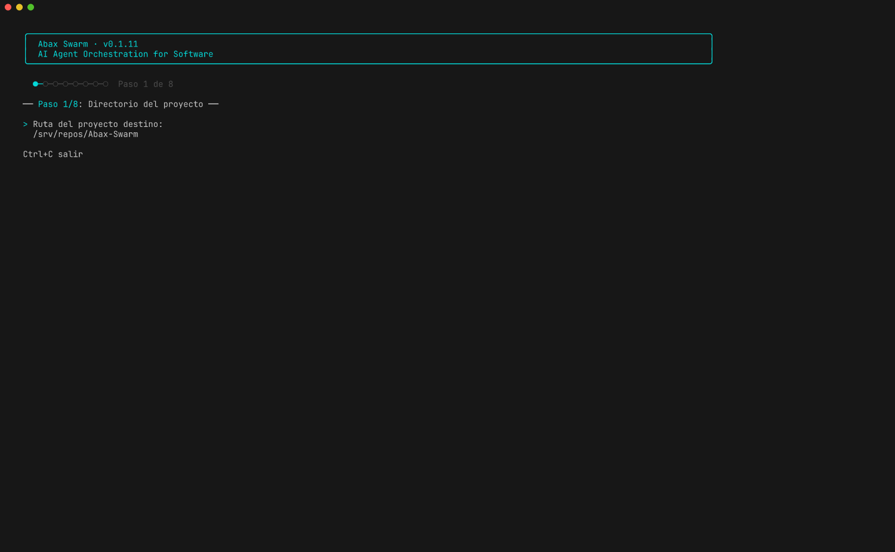
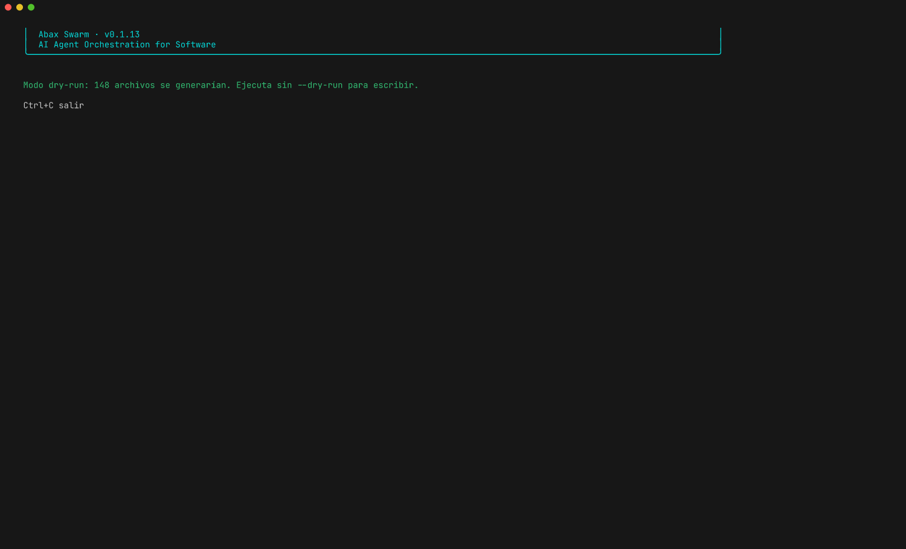
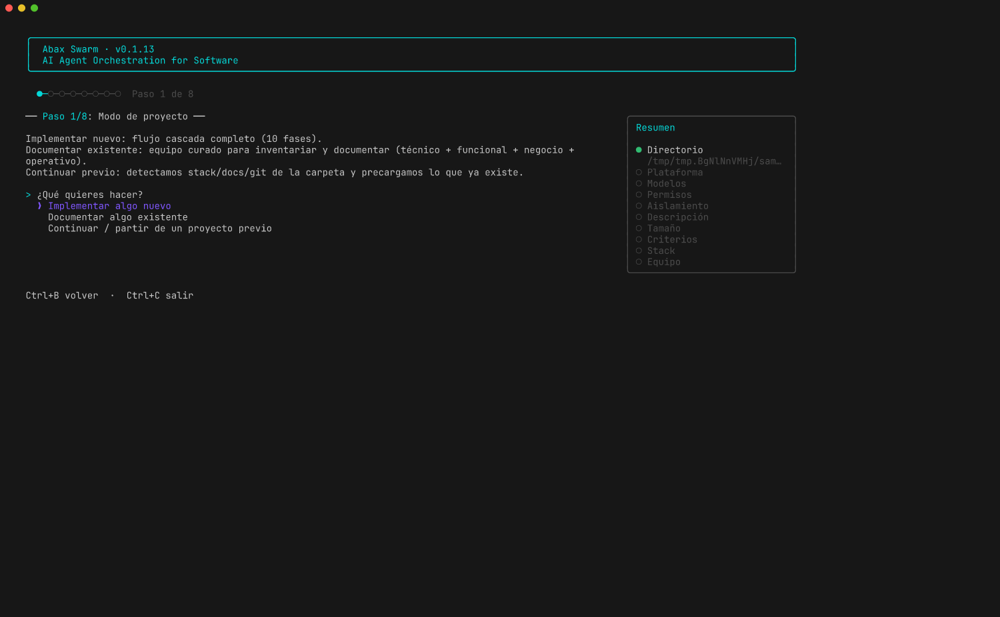
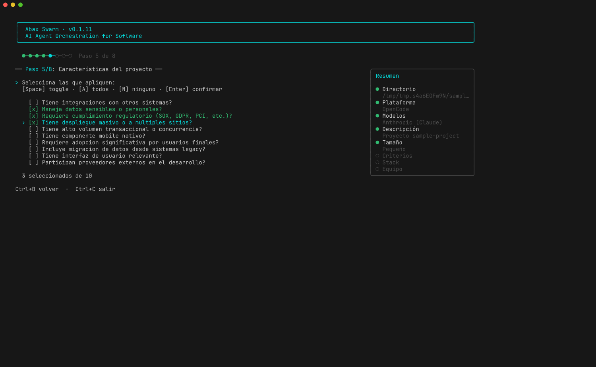
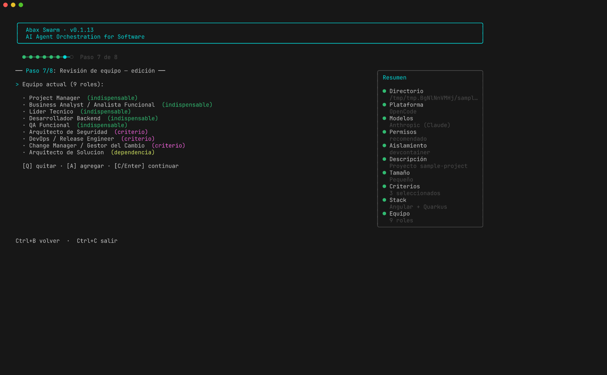

# Abax Swarm

[](https://www.npmjs.com/package/abax-swarm)
[](https://www.npmjs.com/package/abax-swarm)
[](https://github.com/breisnerlopez/Abax-Swarm/actions/workflows/ci.yml)
[](https://github.com/breisnerlopez/Abax-Swarm/actions/workflows/ci.yml)
[](LICENSE)
[](https://nodejs.org)

> **Genera un equipo coordinado de agentes de IA para llevar un proyecto de software de la idea al despliegue — o para documentar uno existente.**

```bash
npm install -g abax-swarm
abax-swarm init
```



---

## ¿Qué es Abax Swarm?

Abax Swarm es una CLI que produce los archivos que tu cliente de IA (**OpenCode** o **Claude Code**) necesita para activar un equipo de **5 a 18 agentes especializados** trabajando en cascada. Un wizard interactivo te pregunta por el stack, el tamaño del proyecto y las características que necesitas; el motor selecciona los roles adecuados y los generadores escriben los archivos de agente, skills, tools y la config de tu plataforma. Después abres tu cliente IA, hablas con el orquestador, y el equipo ejecuta.

---

## Empezar en 2 minutos

### 1. Instalar

Necesitas **Node.js 20 o superior**. Si no lo tienes: [nodejs.org](https://nodejs.org).

```bash
npm install -g abax-swarm
```

### 2. Ejecutar el wizard

```bash
abax-swarm init
```

Se abre un wizard interactivo de 7 pasos. Avanza con Enter, vuelve atrás con `Ctrl+B`. Si solo quieres ver lo que se generaría sin escribir archivos:

```bash
abax-swarm init --dry-run
```



### 3. Responder las preguntas

Sin conocimiento técnico previo. Cada paso explica las opciones; el wizard salta los pasos irrelevantes según el modo elegido.

| Paso | Pregunta | Notas |
|---|---|---|
| 1a | Directorio destino | Por defecto `pwd`. Se crea si no existe. |
| 1b | **Modo de proyecto** | `new` / `document` / `continue` — ver tabla abajo. |
| 2 | Plataforma | OpenCode o Claude Code. |
| 3a | Asignación de modelos | "Personalizado por rol" o "Heredar el default de tu config". |
| 3b | Proveedor IA | (si personalizado) Anthropic o OpenAI. Mix automático: estratégico → opus/gpt-5, implementación → sonnet/mini, mecánico → haiku/nano. |
| 4 | Nombre + descripción | Para que los agentes sepan de qué va el proyecto. |
| 5 | Tamaño + características | Solo modo `new`. Modo `document` tiene equipo curado fijo. |
| 6 | Stack | 14 stacks soportados (incluido `legacy-other`). En `continue` se autodetecta. |
| 7 | Equipo | Revisa, quita o agrega roles. Te avisa si quitas indispensables. |
| 8 | Confirmación | Vista previa con archivos a generar y mix de modelos. Enter genera. |





### 4. Abrir tu proyecto en el cliente IA

```bash
cd ruta/a/tu-proyecto
opencode --agent orchestrator    # OpenCode
# o
claude                            # Claude Code
```

### 5. Hablar con el orquestador

Te recibirá con la fase de descubrimiento — preguntas sobre épicas, features y prioridades. Tú actúas como **Product Owner**: revisas entregables, apruebas pasos, das contexto. El orquestador delega y los agentes ejecutan.

---

## Modos de proyecto

| Modo | Cuándo usarlo |
|---|---|
| **`new`** | Implementar algo desde cero. Cascada completa de 10 fases (descubrimiento → cierre). |
| **`document`** | Inventariar un sistema en producción sin docs vivas. Equipo curado de 9 roles + flujo de 5 fases + sitio MkDocs Material listo. |
| **`continue`** | Retomar un proyecto que ya tiene código, git, docs. Detecta automáticamente stack/git/docs y no re-pregunta lo obvio. |

---

## ¿Por qué usar Abax Swarm?

Trabajar con un único agente de IA en proyectos no triviales produce estos problemas que Abax Swarm previene por diseño:

| Problema | Cómo lo evita |
|---|---|
| **El agente improvisa implementaciones falsas** (regex, mocks, in-memory) y nadie lo detecta hasta producción | 3 capas anti-mock: regla en developers + revisión del tech-lead + validación del BA |
| **Se mezclan responsabilidades** — el mismo rol hace deploy, QA y código y pierde el rigor de cada disciplina | Skill `role-boundaries` en 13 roles + matriz maestra por fase |
| **El sistema legacy se documenta como si fuera un stack moderno** | Stack `legacy-other` con detectores específicos y prompts cautelosos por rol |
| **Se llega a deploy sin haber decidido dónde, cómo se monitorea, o cómo se revierte** | Bloqueante de 12 preguntas en fase 7 + aprobación explícita del sponsor |
| **Los agentes mezclan español e inglés en identificadores de código** | Regla `code-naming-convention`: todo internal en inglés |
| **Un agente sobreescribe docs existentes sin preservar la versión anterior** | Protocolo `existing-docs-update` + estrategia de iteración con respaldo |

Cada una de estas protecciones nació de incidentes reales y está cubierta por tests automatizados que fallan en CI si alguien intenta diluirlas. Documentación detallada de cada guard rail en el [índice de docs](docs/README.md).

---

## ¿Qué se genera?

Cuando confirmas, Abax Swarm escribe esta estructura en tu carpeta:

```
tu-proyecto/
├── .opencode/                    (o .claude/, según la plataforma elegida)
│   ├── agents/
│   │   ├── orchestrator.md       ← Coordina a todos (color: rojo crimson)
│   │   ├── project-manager.md    ← Color asignado de paleta determinista por id
│   │   ├── business-analyst.md
│   │   ├── solution-architect.md
│   │   ├── developer-backend.md
│   │   └── …                     (5 a 18 agentes según tamaño)
│   ├── skills/                   ← Conocimientos reutilizables (80 skills disponibles)
│   └── tools/                    ← Herramientas que los agentes pueden ejecutar
├── docs/
│   ├── design-system/
│   │   └── presentacion-template.html   ← HTML autónomo, 3 presets visuales
│   └── entregables/              ← Aquí van los outputs de cada fase
├── opencode.json                 ← Config de la plataforma
└── project-manifest.yaml         ← Metadata reproducible

# Solo en modo "documentar":
├── mkdocs.yml                    ← Listo para `mkdocs serve`
├── requirements.txt              ← `mkdocs-material>=9.5`
└── docs/<fase>/index.md          ← Seeds por las 5 fases del flujo de docs

# Solo si tu carpeta tiene git:
└── .github/workflows/pages.yml   ← Workflow para publicar presentaciones en GitHub Pages
```

### Detalles que mejoran la experiencia

- **Colores en TUI**: orquestador siempre rojo crimson `#dc143c`. Los demás agentes reciben colores vivos de una paleta curada de 24 hex, determinista por `role.id`. Detalle: [docs/agent-colors.md](docs/agent-colors.md).
- **Glosario automático**: si un entregable usa ≥3 acrónimos técnicos (RACI, SLA, BPMN, OWASP), el agente añade una sección `## Glosario` con definiciones cortas.
- **Presentaciones HTML autónomas**: agentes con skill `presentation-design` generan single-file HTML con 3 presets (Corporate Minimal / Tech Editorial / Dark Premium).
- **Devcontainer auto-generado**: si elegiste isolación por container, recibes `.devcontainer/devcontainer.json` por stack.

---

## El equipo

La selección de agentes se basa en el tamaño y las características que marques en el wizard. El equipo base siempre incluye: Project Manager, Product Owner, Business Analyst, Solution Architect, Tech Lead, Backend Developer, Frontend Developer, QA Lead, QA Funcional y DevOps. Según las características se añaden especialistas: DBA, Security Architect, Integration Architect, QA Automation, QA Performance, UX Designer, Tech Writer y Change Manager.

Los agentes trabajan en una cascada de **10 fases** — desde Descubrimiento hasta Cierre — con entregables obligatorios por fase y un rol que la aprueba. El orquestador no avanza si la fase actual no está completa. Documentación detallada: [architecture.md](docs/architecture.md).

---

## Comandos

```bash
abax-swarm init                              # asistente interactivo
abax-swarm init --dry-run                    # vista previa sin escribir
abax-swarm roles                             # listar roles disponibles
abax-swarm stacks                            # listar stacks
abax-swarm validate                          # validar los YAML de data/
abax-swarm regenerate                        # regenerar desde manifest (carpeta actual)
abax-swarm regenerate --dir /ruta/proyecto   # o especificar otra carpeta
```

---

## Stacks soportados (14 disponibles)

`react-nextjs` · `react-nestjs` · `vue-nuxt` · `angular-springboot` · `angular-quarkus` · `astro-hono` · `python-fastapi` · `python-django` · `dotnet-blazor` · `go-fiber` · `rust-axum` · `flutter-dart` · `react-native-expo` · `legacy-other` (PHP, Java Swing, VB6, Cobol, Delphi, etc.)

Para sistemas legacy sin stack reconocible, usa `legacy-other`: los agentes reciben prompts cautelosos que les ordenan inferir convenciones del código en lugar de asumir patrones modernos. Detalle: [docs/legacy-stacks.md](docs/legacy-stacks.md).

---

## Guías prácticas

| Quiero… | Documento |
|---|---|
| Entender cómo asigna modelos a cada rol y cambiarlo | [docs/model-mix.md](docs/model-mix.md) |
| Crear un rol personalizado sin tocar TypeScript | [docs/guides/adding-roles.md](docs/guides/adding-roles.md) |
| Añadir una skill o herramienta nueva | [docs/guides/adding-skills.md](docs/guides/adding-skills.md) |
| Agregar soporte para un stack nuevo | [docs/guides/adding-stacks.md](docs/guides/adding-stacks.md) |
| Modificar el flujo del orquestador | [docs/guides/orchestrator-flow.md](docs/guides/orchestrator-flow.md) |

---

## FAQ

**¿Necesito Opus o GPT-5 para usarlo?**
No. El paso 3 del wizard te ofrece "Heredar el default de mi configuración" — los agentes generados no llevan `model:` y tu cliente IA usa el modelo que tengas configurado globalmente.

**¿Funciona offline?**
La generación de archivos sí (no hace llamadas a LLMs). Lo que requiere LLM es lo que pase _después_, cuando abras tu cliente IA con los archivos generados.

**¿Puedo usarlo en un repo privado de empresa?**
Sí. Los archivos generados son tuyos. Lo que se publica a npm es la CLI, no nada del proyecto cliente.

**Mi stack no está en los 14 soportados (Cobol, Delphi, ASP clásico…). ¿Qué hago?**
Usa el stack `legacy-other` — los agentes reciben prompts cautelosos que infieren convenciones del código en lugar de asumir patrones modernos.

**¿Por qué cascada y no agile/scrum?**
Por trazabilidad y RACI explícita en proyectos corporativos. Si quieres adaptar a sprints, edita `data/rules/raci-matrix.yaml` y `data/rules/document-mode.yaml`.

---

## Recursos

| Documento | Para qué |
|---|---|
| [docs/architecture.md](docs/architecture.md) | Capas del sistema, modos de proyecto, flujo de datos |
| [docs/data-model.md](docs/data-model.md) | Esquemas YAML de cada entidad (roles, skills, tools, stacks) |
| [docs/model-mix.md](docs/model-mix.md) | Mix de modelos por rol con justificación |
| [docs/legacy-stacks.md](docs/legacy-stacks.md) | Stack `legacy-other` para sistemas legacy |
| [docs/guides/adding-roles.md](docs/guides/adding-roles.md) | Cómo agregar un rol propio sin tocar TypeScript |
| [docs/README.md](docs/README.md) | Índice completo de la documentación |

---

## Contribuir

¡Bienvenidas todas las contribuciones! La guía completa vive en [CONTRIBUTING.md](CONTRIBUTING.md) e incluye:

- Arquitectura del código, estructura del repo y comandos de desarrollo
- Quickstart para tu primer PR
- Cómo añadir roles, skills, tools o stacks (solo YAML, sin tocar TypeScript)
- Guard rails y tests que tu cambio debe satisfacer
- Flujo de release y publicación a npm

Antes de un PR grande, abre un [discussion](https://github.com/breisnerlopez/Abax-Swarm/discussions) para confirmar la dirección.

---

## Soporte

- **Bugs y feature requests**: [Issues](https://github.com/breisnerlopez/Abax-Swarm/issues)
- **Preguntas y propuestas**: [Discussions](https://github.com/breisnerlopez/Abax-Swarm/discussions)
- **Seguridad**: si encuentras una vulnerabilidad, NO abras un issue público — escribe a `breisner.lopez@gmail.com`

---

## Requisitos

- Node.js >= 20
- npm

## Licencia

MIT — ver [LICENSE](LICENSE).
